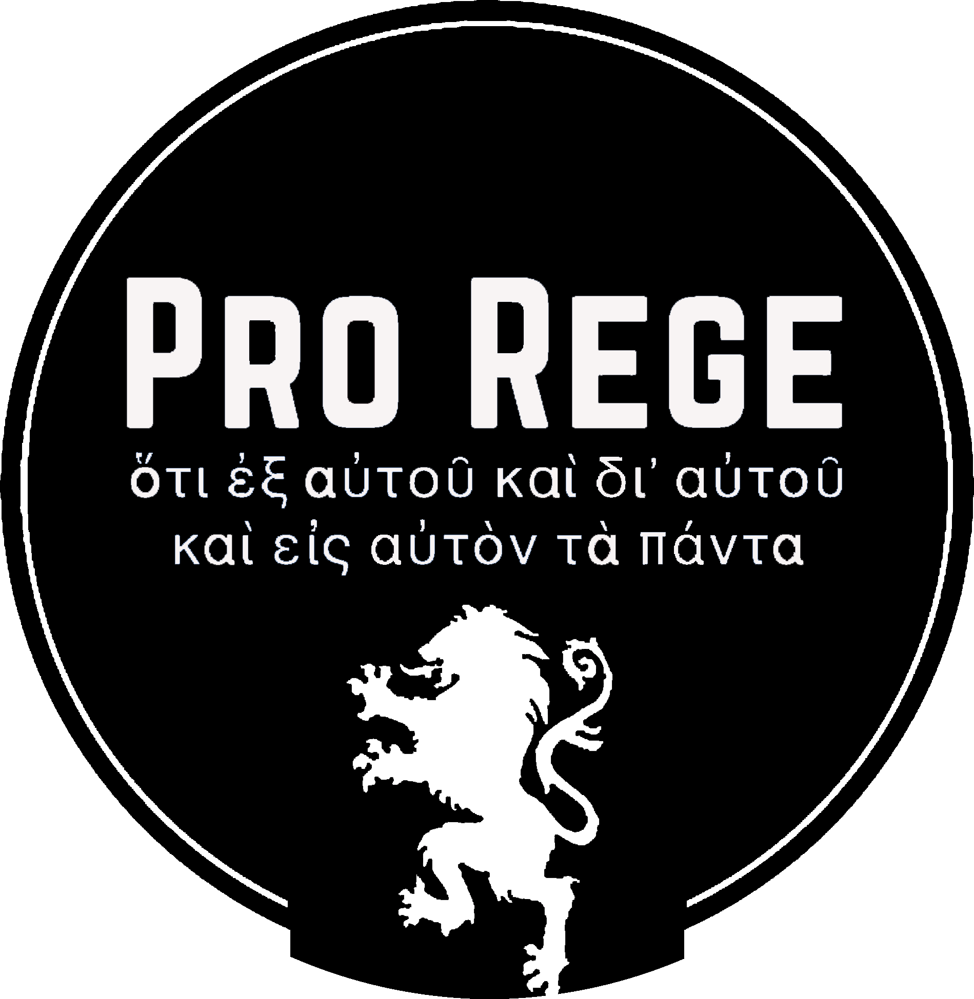

  

# Pro Rege

*"For of him, and through him, and to him, are all things."* — Romans 11:36

A multi-article project defending a strict 1646 Westminster Standards account of the relationship between the covenant of works and the covenant of grace across both Testaments — moral law, natural law, and grace under each administration — written in critical engagement with Klinean republication and its political-theological descendants.

See [`00-foundations/manifesto.md`](00-foundations/manifesto.md) for the full statement, and [`CLAUDE.md`](CLAUDE.md) for project structure, house rules, and how work here gets done.

Companion site (primary-source transcriptions and republished Reformed texts): [pro-rege.com](https://pro-rege.com)
